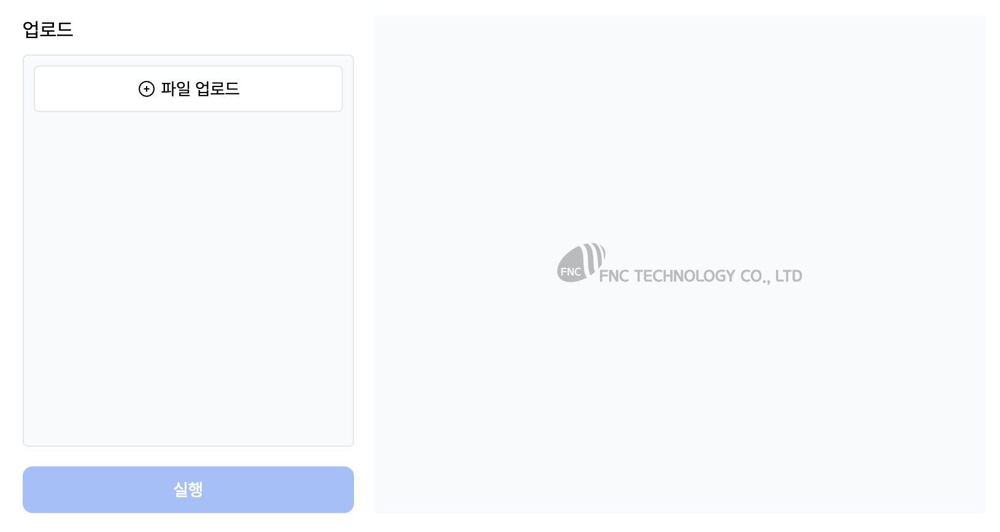
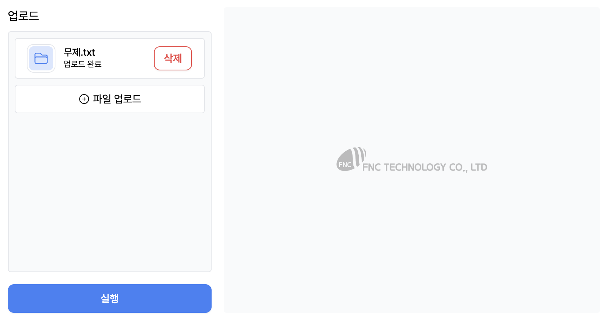
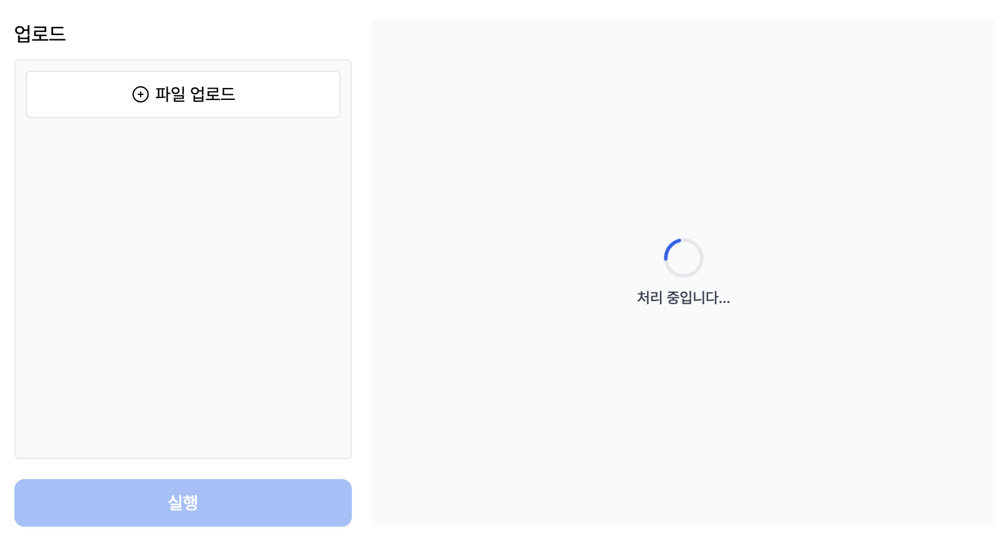
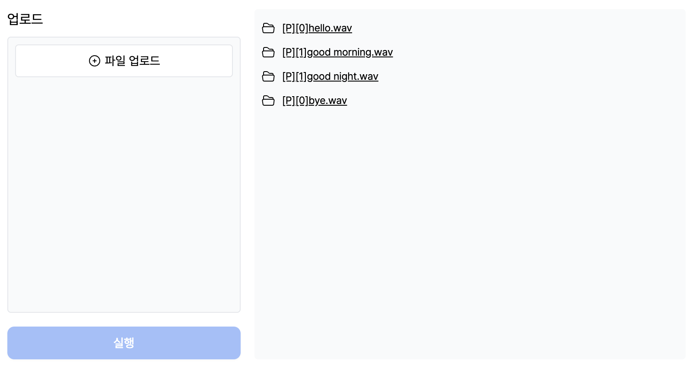

# LightSpeech WebUI

[LightSpeech: Lightweight and Fast Text to Speech with Neural Architecture Search, ICASSP 2021](https://arxiv.org/abs/2102.04040), by Renqian Luo, Xu Tan, Rui Wang, Tao Qin, Jinzhu Li, Sheng Zhao, Enhong Chen and Tie-Yan Liu  
[Original Github](https://github.com/microsoft/NeuralSpeech/blob/master/LightSpeech)

## Dependencies

- Python=3.8
- Python Packages:

```bash
cd LightSpeech/backend
pip install -r requirements.txt
```

- [Docker](https://www.docker.com/get-started/)

## How to Start

### 1. Build and run Frontend with Docker

```bash
cd .. # move to LightSpeech
docker-compose up -d # build docker
```

Now you can access to localhost:3000

### 2. Run Backend with python

```bash
mkdir backend/data
```

download ljspeech data from [here](https://drive.google.com/drive/folders/17UkcWbZ7hIIrfSCG_MjaiAw82NCL0LJN) and move to LightSpeech/backend/data

```bash
# run main.py
cd backend
python main.py
```

### 3. UI screenshot





